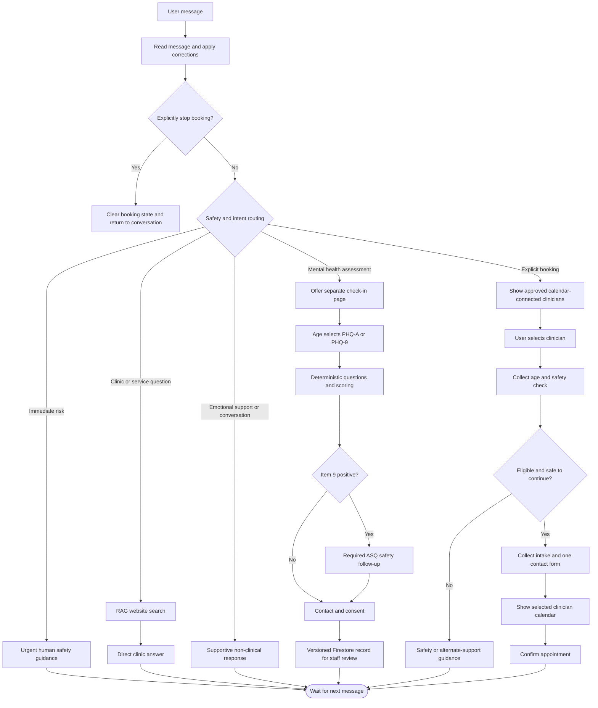

# Current Chat and Assessment Flow

This reflects the conversational-first LangGraph, the secondary booking branch,
and the separate deterministic screening page.

## Operational Boundaries

- The LLM may route and converse, but it does not alter screening questions,
  calculate scores, diagnose, or decide the screening safety level.
- A booking decline clears the current booking thread, including paused forms.
- Only clinicians with `published_on_website=true`,
  `accepting_online_bookings=true`, `is_demo!=true`, and a healthy calendar are
  shown in the public booking UI.
- `carecoordinator-calendar-health.timer` maintains calendar connection status
  separately from both user workflows.
- Screening submissions require a clinic-owned staff review queue and escalation
  policy before production launch. The public page explicitly states that it is
  not monitored as an emergency service.
