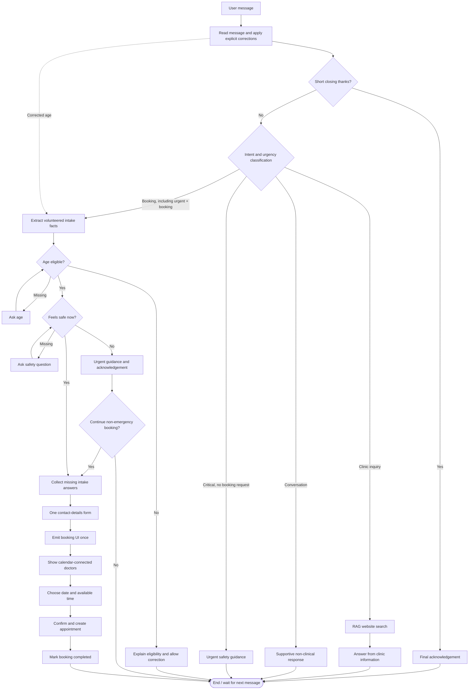

# Current Chat Agent Flow

This diagram reflects the current LangGraph and WebSocket booking implementation.

Calendar connection health is maintained separately from the chat graph by
`carecoordinator-calendar-health.timer`. It runs the maintenance container
approximately every 15 minutes and updates each doctor's connection status.
